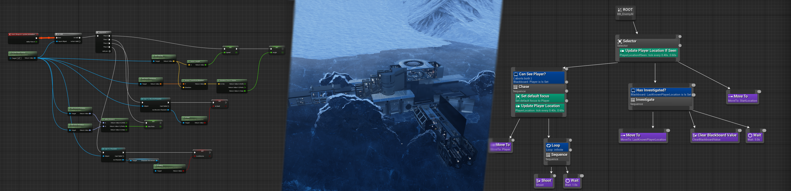
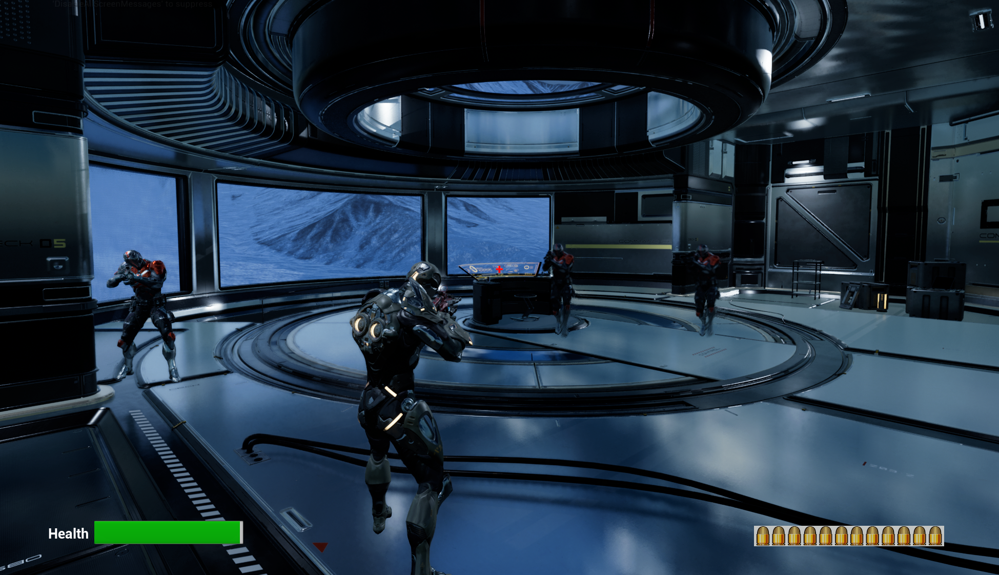

## Third Person Game

**This project was developed using Unreal Engine 5.2 with C++ and Blueprint features.**
 
 

In this game, the main character should survive by searching throughout the map and destroying all enemies. 
 

## Features

- AI Movement/Behavior
- Behavior Trees (Tasks and Sequences) and Blackboards
- Weapon Sounds Effects
- Background Sound
- Sound Randomization and Spatialization
- UIs and HUDs
- 2D Blend Spaces
- Animation State Machines
- Weapon Switching
- Reload Ammo
 

## Reference

This project was developed on top of [Unreal Engine 5 C++ Developer course](https://www.udemy.com/course/unrealcourse/).
